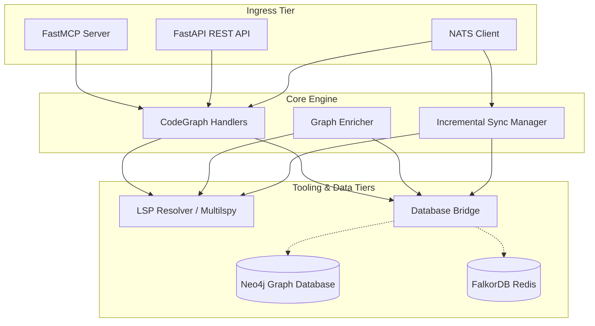

# Graphify CodeGraph Functions Sidecar

A production-grade, multi-interface architectural sidecar serving as the event-reactive bridge between static codebases and graph database schemas. The service wraps a core graph abstraction layer (supporting Neo4j and FalkorDB) and an asynchronous language server (via `multilspy`), exposing them concurrently through three access tiers: FastMCP (stdio), FastAPI (REST), and NATS (PubSub).

The intention is to take graphify and add functionality to bring it up to par with gitnexus and beyond

Instead of replacing graphify, it is intended to replace the functionality that gitnexus brings to the table, as a sidecar for graphify


## System Architecture



---

## Canonical Schema Mapping

The sidecar layers GitNexus metrics directly over the Graphify graph schema:

### Nodes
- **`:Entity`**: Mandatory label for all code elements.
  - `id`: Unique UUID identifier.
  - `name`: Raw symbol name.
  - `file_path`: Project-relative path.
  - `start_line`: 1-indexed start line.
  - `end_line`: 1-indexed end line.
  - `file_type`: `'code' | 'concept' | 'document' | 'image' | 'paper' | 'rationale'`.
  - `gitnexus_risk_factor`: `'CRITICAL' | 'HIGH' | 'LOCALIZED'`.
  - `gitnexus_blast_depth`: Precomputed blast depth integer.
- **`:ProcessRoot`**: Frame entry-point node for sequential tracking.

### Relationships
- `[:CALLS]`: Call dependencies.
- `[:IMPORTS]`: Import dependencies.
- `[:REFERENCES]`: Reference dependencies.
- `[:IMPLEMENTS]`: Object polymorphism / inheritance dependencies.
- `[:REFERENCES_TYPE]`: Type resolution dependencies.
- `[:OVERRIDES]`: Subclass overrides parent implementations.
- `[:NEXT_STEP {process: string, sequence_order: int}]`: Sequential execution paths.

---

## Technical Specifications & Interfaces

### 1. FastMCP Interface (stdio)
Exposes the following tools:
* `gitnexus_impact(symbol_name, max_depth)`: Evaluate symbol blast radius.
* `gitnexus_detect_changes(diffs)`: Compute change blast radius.
* `gitnexus_context(symbol_name)`: Fetch properties and neighboring relationships.
* `gitnexus_query(query, parameters)`: Execute direct Cypher queries.
* `gitnexus_rename(uri, line, character, new_name)`: Workspace-wide renaming.

### 2. FastAPI REST Interface
* `POST /api/v1/impact`: `{"symbol_name": str, "max_depth": int}` -> Returns JSON blast radius with decaying confidence scores ($0.9^{depth}$).
* `POST /api/v1/detect-changes`: `{"diffs": [{"uri": str, "content": str, "line": int, "character": int}]}` -> Returns structural changes.
* `POST /api/v1/rename`: `{"uri": str, "line": int, "character": int, "new_name": str}` -> Modifies workspace files and syncs DB.
* `POST /api/v1/context`: `{"symbol_name": str}` -> Returns properties, relationships, and ProcessRoot ancestors.

### 3. NATS PubSub Interface
* Subscribes to `gitnexus.commands.>`:
  - `gitnexus.commands.detect_changes`: Computes structural changes.
  - `gitnexus.commands.graph_sync`: Merges and records re-indexing configurations.
  - `gitnexus.commands.enrich_graph`: Triggers the async semantic enrichment pipeline.
* Subscribes to `gitnexus.events.file_changed`:
  - Triggers incremental file re-indexing (purging old subtree entities, updating LSP state, and re-merging semantic links).

---

## Configuration

Set the following environment variables to configure the service:

| Variable | Description | Default |
|---|---|---|
| `GRAPH_ENGINE` | Active graph database backend (`neo4j` or `falkordb`) | `neo4j` |
| `NEO4J_URI` | Neo4j URI connection string | `bolt://127.0.0.1:7687` |
| `FALKORDB_HOST` | FalkorDB Redis host | `127.0.0.1` |
| `NATS_URL` | Comma-separated list of NATS server URLs | `nats://127.0.0.1:4222` |
| `LSP_LANGUAGE` | multilspy language configuration (`python`, `typescript`, etc.) | `python` |
| `LSP_ROOT_PATH` | Path to workspace folder | Current working directory |
| `API_HOST` | FastAPI bind address | `127.0.0.1` |
| `API_PORT` | FastAPI bind port | `8000` |

---

## Verification & Testing

Ensure Nix shell packages are initialized:
```bash
nix develop
```

Run the unit and E2E integration test suites:
```bash
pytest tests/
```
